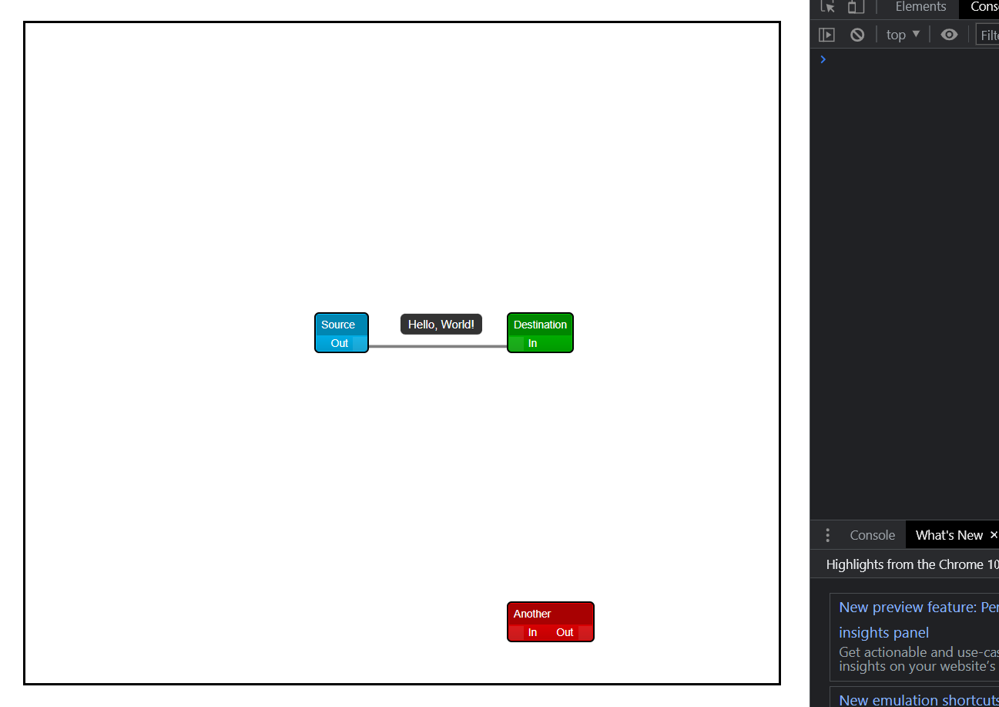

# app-ui

The following is the takehome assignment for mage dev

### Setting up the project

Make sure that **node** is installed in your PC to run this project.

The project consists of two components frontend and backend.
We need to install dependencies for both of them by doing
**npm install** once in the root project folder and in the server folder again

Instead of doing npm install twice you can simply run the 
**install.sh** file that will install all the dependencies required for the project.

Once the script completes you are good to go 

simply run 

> npm start

in the root project directory the client should be up and running on port 3000 and the backend service on port 5000.

### Output screenshots

The output looks something like this

Whenever two nodes are connected by a link a network request is made to backend
as illustrated below

The payload for the request looks something like below a link between source and another node is established and the payload explains the same.

